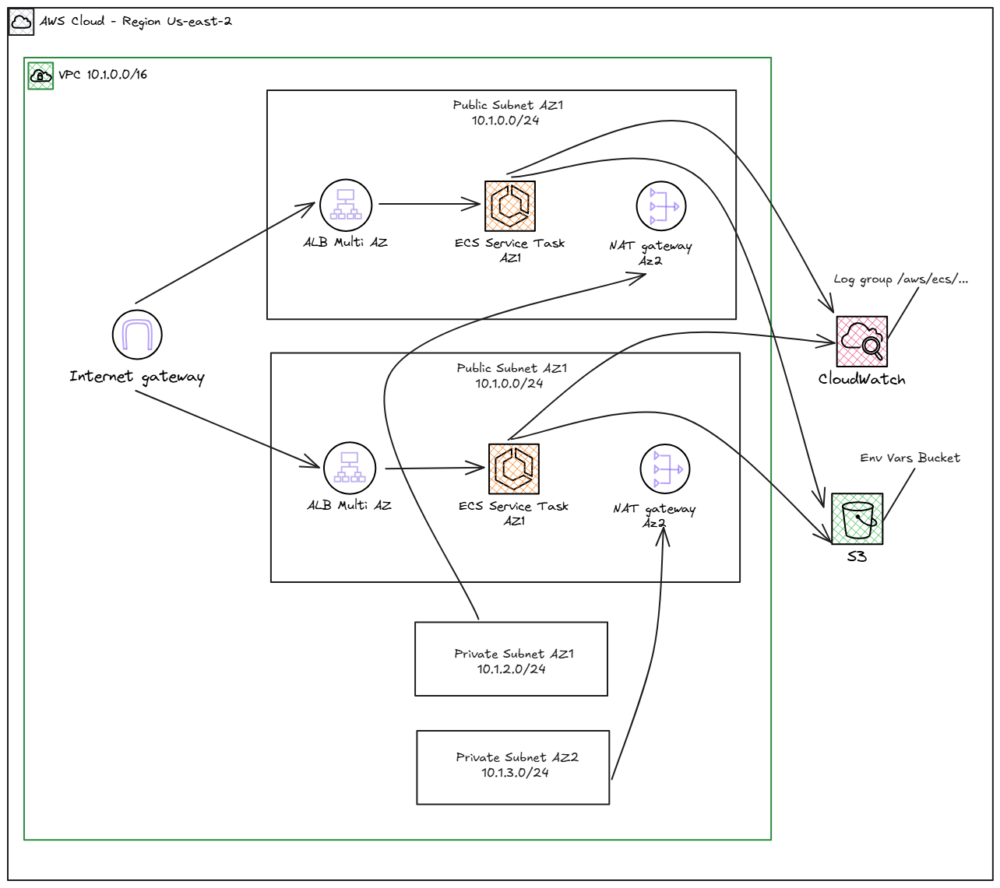

# 🚀 Web Application with AWS ECS

Este projeto demonstra a implementação de uma aplicação web usando **Amazon ECS (Elastic Container Service)** com **Application Load Balancer (ALB)**, provisionada através do **Terraform** em um ambiente Docker. A arquitetura é projetada para alta disponibilidade, escalabilidade e melhores práticas de segurança.

## 🏗️ Arquitetura do Projeto

### Diagrama de Arquitetura



### Componentes da Arquitetura

#### 🌐 **Networking (VPC)**
- **VPC**: Rede virtual privada com CIDR `10.1.0.0/16`
- **Subnets Públicas**: Duas subnets em zonas de disponibilidade diferentes para alta disponibilidade
- **Internet Gateway**: Permite acesso à internet para recursos públicos
- **Route Tables**: Configuradas para rotear tráfego adequadamente

#### ⚖️ **Load Balancer**
- **Application Load Balancer (ALB)**: Distribui tráfego HTTP/HTTPS entre as instâncias ECS
- **Target Group**: Gerencia health checks e roteamento para containers
- **Security Group**: Permite tráfego HTTP (porta 80) de qualquer origem

#### 🐳 **Container Orchestration (ECS)**
- **ECS Cluster**: Orquestra containers usando AWS Fargate
- **ECS Service**: Mantém o número desejado de tarefas em execução
- **Task Definition**: Define especificações do container (CPU, memória, image)
- **Security Group**: Permite tráfego apenas do ALB na porta do container

#### 🔐 **Security & Access Management (IAM)**
- **Execution Role**: Permite ao ECS baixar imagens e escrever logs
- **Task Role**: Permissões específicas para a aplicação em execução
- **Políticas Anexadas**: 
  - `AmazonECSTaskExecutionRolePolicy`
  - `AmazonS3ReadOnlyAccess`

#### 📦 **Storage & Configuration**
- **S3 Bucket**: Armazena arquivos de variáveis de ambiente
- **Environment Files**: Configurações dinâmicas carregadas do S3

#### 📊 **Monitoring & Logging**
- **CloudWatch Log Group**: Centraliza logs dos containers
- **Log Streams**: Organizados por container e timestamp

## 🛠️ Tecnologias Utilizadas

- **Infrastructure as Code**: Terraform
- **Container Platform**: Amazon ECS with Fargate
- **Load Balancing**: Application Load Balancer (ALB)
- **Networking**: Amazon VPC
- **Storage**: Amazon S3
- **Monitoring**: Amazon CloudWatch
- **Security**: AWS IAM, Security Groups
- **Development Environment**: Docker + Docker Compose

## 📋 Pré-requisitos

- Docker e Docker Compose instalados
- Credenciais AWS configuradas
- Conta AWS com permissões adequadas
- Git para clonagem do repositório

## 🚀 Como Executar o Projeto

### 1. Clonagem e Preparação

```bash
git clone https://github.com/JadesonBruno/di-web-aplication-with-aws-ecs.git
cd di-web-aplication-with-aws-ecs
```

### 2. Configuração das Credenciais AWS

Crie o arquivo `.env` na raiz do projeto com suas credenciais:

```env
# AWS credentials for CLI in container  
AWS_ACCESS_KEY_ID=sua_access_key_aqui
AWS_SECRET_ACCESS_KEY=sua_secret_key_aqui
AWS_DEFAULT_REGION=us-east-2
```

> **⚠️ IMPORTANTE**: O arquivo `.env` contém credenciais sensíveis e está listado no `.gitignore`. Nunca commite credenciais no controle de versão.

### 3. Inicialização da Infraestrutura

Execute os seguintes comandos na pasta raiz do projeto:

```bash
# 1. Construir e iniciar o container
docker-compose up -d --build

# 2. Acessar o container
docker-compose exec terraform /bin/bash

# 3. Dentro do container, inicializar o Terraform
terraform init

# 4. Aplicar a infraestrutura
terraform apply
```

### 4. Verificação do Deploy

Após a execução bem-sucedida, você receberá os outputs:
- **ALB DNS Name**: URL para acessar sua aplicação
- **ECS Cluster Name**: Nome do cluster criado
- **VPC ID**: Identificador da VPC criada

## 📁 Estrutura do Projeto

```
di-web-aplication-with-aws-ecs/
├── terraform/                          # Configuração Terraform
│   ├── main.tf                        # Configuração principal
│   ├── variables.tf                   # Definição de variáveis
│   ├── outputs.tf                     # Outputs da infraestrutura
│   ├── providers.tf                   # Configuração de providers
│   ├── terraform.tfvars               # Valores das variáveis
│   └── modules/                       # Módulos Terraform
│       ├── vpc/                       # Módulo de networking
│       ├── ecs/                       # Módulo ECS e ALB
│       └── env_vars_bucket/           # Módulo S3 para env vars
├── dockerfile                         # Container para Terraform
├── docker-compose.yaml               # Orquestração local
├── .env                              # Credenciais AWS (não versionado)
├── .gitignore                        # Arquivos ignorados pelo Git
└── README.md                         # Documentação do projeto
```

## 🔧 Configurações Personalizáveis

No arquivo `terraform.tfvars` você pode ajustar:

```hcl
# Configurações Globais
project_name = "web-app-ecs"
environment  = "dev"
aws_region   = "us-east-2"

# Configurações de Rede
vpc_cidr_block = "10.1.0.0/16"

# Configurações ECS
cpu = "1024"                    # CPU units (1024 = 1 vCPU)
memory = "2048"                 # Memória em MiB
docker_image = "nginx:latest"   # Imagem do container
container_port = 80             # Porta do container
alb_port = 80                   # Porta do ALB
desired_count = 2               # Número de tarefas desejadas
```

## 🔒 Segurança e Boas Práticas

### Credenciais AWS (.env)
- **Finalidade**: Armazena credenciais AWS de forma segura para o container Terraform
- **Localização**: Raiz do projeto (não versionado)
- **Formato**: Variáveis de ambiente no formato `KEY=VALUE`
- **Segurança**: 
  - Nunca commit credenciais no Git
  - Use IAM users com permissões mínimas necessárias
  - Considere usar AWS IAM Roles para produção
  - Rotacione credenciais regularmente

### Security Groups
- **ALB Security Group**: Permite apenas tráfego HTTP/HTTPS da internet
- **ECS Security Group**: Permite tráfego apenas do ALB Security Group
- **Princípio do Menor Privilégio**: Cada componente tem acesso mínimo necessário

### IAM Roles
- **Execution Role**: Permissões para ECS gerenciar containers
- **Task Role**: Permissões específicas para a aplicação

## 🧪 Validação e Testes

```bash
# Validar configuração Terraform
terraform validate

# Planejar mudanças antes de aplicar
terraform plan

# Verificar recursos criados
terraform state list

# Acessar logs dos containers
aws logs describe-log-groups --region us-east-2
```

## 🧹 Limpeza de Recursos

Para evitar custos desnecessários, sempre execute:

```bash
terraform destroy
```

## 📚 Recursos e Referências

- [AWS ECS Documentation](https://docs.aws.amazon.com/ecs/)
- [Terraform AWS Provider](https://registry.terraform.io/providers/hashicorp/aws/latest/docs)
- [Docker Compose Documentation](https://docs.docker.com/compose/)
- [AWS Security Best Practices](https://docs.aws.amazon.com/security/)

## 🔄 Próximos Passos e Melhorias

- [ ] Implementar HTTPS com certificado SSL/TLS
- [ ] Adicionar Auto Scaling baseado em métricas
- [ ] Configurar CI/CD pipeline
- [ ] Implementar monitoramento avançado com alarmes
- [ ] Adicionar testes de infraestrutura
- [ ] Configurar backup e disaster recovery

## 📞 Suporte e Contato

**Jadeson Bruno**
- Email: jadesonbruno.a@outlook.com
- GitHub: [@JadesonBruno](https://github.com/JadesonBruno)
- LinkedIn: [Jadeson Bruno](https://www.linkedin.com/in/jadeson-silva/)
